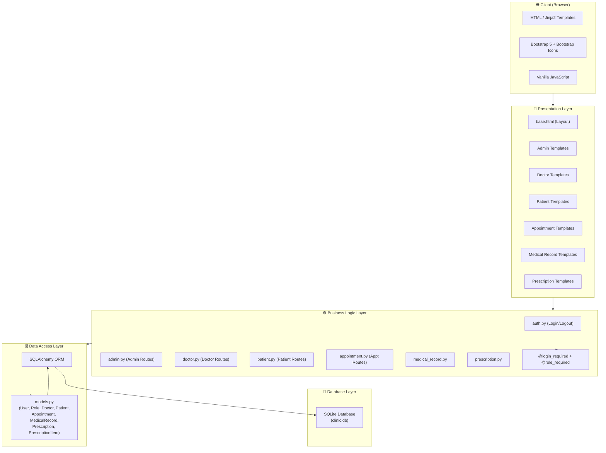
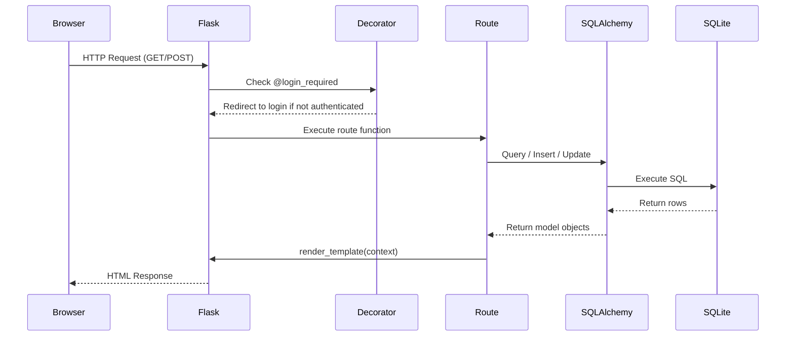
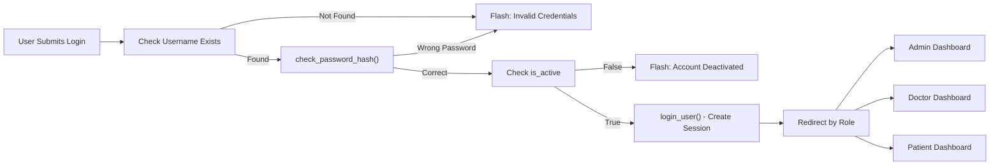

# System Architecture
## Clinic Management System (ClinicMS)

---

## Overview

ClinicMS follows a **three-tier layered architecture** built on the Flask micro-framework. The architecture cleanly separates concerns across three primary layers: Presentation, Business Logic, and Data Access.

---

## Architecture Diagram



---

## Layer Descriptions

### 1. Presentation Layer

The presentation layer renders HTML pages using **Jinja2** templating engine, which is integrated with Flask. All templates extend `base.html` which provides:
- Navigation sidebar with role-aware menu items
- Flash message display area
- Bootstrap 5 CSS/JS includes
- Bootstrap Icons CDN

**Template Organization:**
```
templates/
├── base.html              # Master layout template
├── auth/
│   ├── login.html
│   └── register.html
├── admin/
│   ├── dashboard.html
│   ├── doctors.html
│   ├── add_doctor.html
│   ├── edit_doctor.html
│   ├── patients.html
│   ├── add_patient.html
│   ├── edit_patient.html
│   └── users.html
├── doctor/
│   ├── dashboard.html
│   ├── appointments.html
│   ├── patients.html
│   ├── profile.html
│   └── edit_profile.html
├── patient/
│   ├── dashboard.html
│   ├── appointments.html
│   ├── medical_records.html
│   └── prescriptions.html
├── appointments/
│   ├── list.html
│   ├── book.html
│   └── detail.html
├── medical_records/
│   ├── list.html
│   ├── create.html
│   └── detail.html
└── prescriptions/
    ├── list.html
    ├── create.html
    └── detail.html
```

**Technologies Used:**
- **Jinja2**: Server-side templating with inheritance, filters, and macros
- **Bootstrap 5.3**: Responsive grid system, components, utilities
- **Bootstrap Icons**: Icon set for UI elements
- **Vanilla JS**: Confirmation dialogs, dynamic form rows

---

### 2. Business Logic Layer

The business logic is organized using **Flask Blueprints**, each responsible for a specific domain:

| Blueprint | Prefix | Responsibility |
|---|---|---|
| `auth` | `/auth` | Login, logout, session management |
| `admin` | `/admin` | Admin CRUD for doctors, patients, users |
| `doctor` | `/doctor` | Doctor dashboard, profile, appointments |
| `patient` | `/patient` | Patient dashboard, records view |
| `appointment` | `/appointment` | Book, cancel, complete appointments |
| `medical_record` | `/medical-record` | Create and view medical records |
| `prescription` | `/prescription` | Create and view prescriptions |

**Access Control Decorators:**
```python
@login_required          # Flask-Login: must be authenticated
@admin_required          # Custom: role must be 'admin'
@doctor_required         # Custom: role must be 'doctor'
@patient_required        # Custom: role must be 'patient'
```

**Key Business Logic:**
- Password hashing via `generate_password_hash()` (PBKDF2-SHA256)
- Appointment conflict detection via database query
- Role-based query filtering (patients only see own records)
- Age calculation from date of birth

---

### 3. Data Access Layer

All database operations use **Flask-SQLAlchemy** ORM, preventing direct SQL exposure and enabling:
- Type-safe query building
- Relationship navigation (`doctor.user.full_name`)
- Lazy loading of related objects
- Automatic SQL injection prevention

**Model Structure:**
```
models.py
├── Role          (id, name)
├── User          (id, role_id → Role, username, email, password_hash, ...)
├── Doctor        (id, user_id → User, specialty, license_number, ...)
├── Patient       (id, user_id → User, date_of_birth, gender, blood_type, ...)
├── Appointment   (id, patient_id → Patient, doctor_id → Doctor, ...)
├── MedicalRecord (id, patient_id → Patient, doctor_id → Doctor, ...)
├── Prescription  (id, patient_id → Patient, doctor_id → Doctor, ...)
└── PrescriptionItem (id, prescription_id → Prescription, ...)
```

---

### 4. Database Layer

- **Database**: SQLite (file-based, no server required)
- **File**: `instance/clinic.db`
- **ORM**: SQLAlchemy handles schema creation via `db.create_all()`
- **Seeding**: `seed.py` populates demo data on first run

---

## Data Flow



---

## Security Flow



---

## Component Responsibilities

| Component | File | Responsibility |
|---|---|---|
| Application Factory | `app/__init__.py` | Creates Flask app, registers blueprints, configures extensions |
| Configuration | `config.py` | Environment-specific settings (DEBUG, SECRET_KEY, DATABASE_URI) |
| Extensions | `app/extensions.py` | SQLAlchemy and LoginManager instances |
| Models | `app/models.py` | Database schema, relationships, helper methods |
| Auth Routes | `app/routes/auth.py` | Login/logout logic |
| Admin Routes | `app/routes/admin.py` | Full CRUD for users, doctors, patients |
| Doctor Routes | `app/routes/doctor.py` | Doctor-specific views |
| Appointment Routes | `app/routes/appointment.py` | Booking, cancellation, completion |
| Entry Point | `run.py` | Starts Flask development server |
| Seeder | `seed.py` | Creates demo data |
