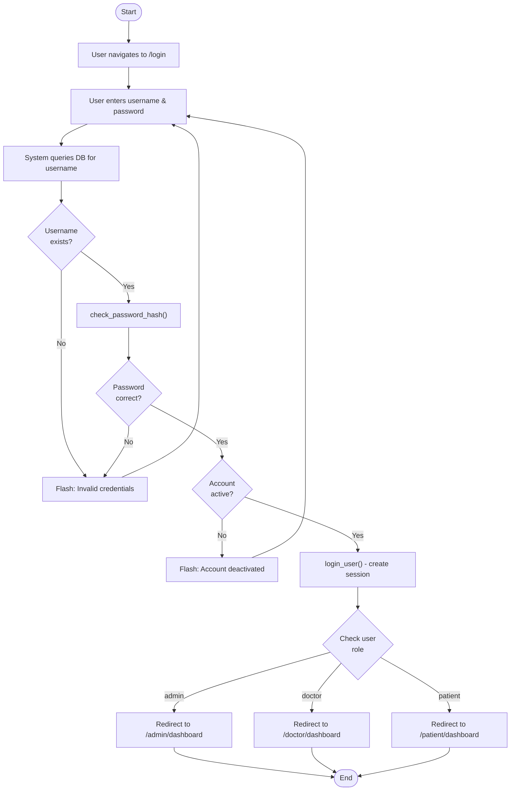
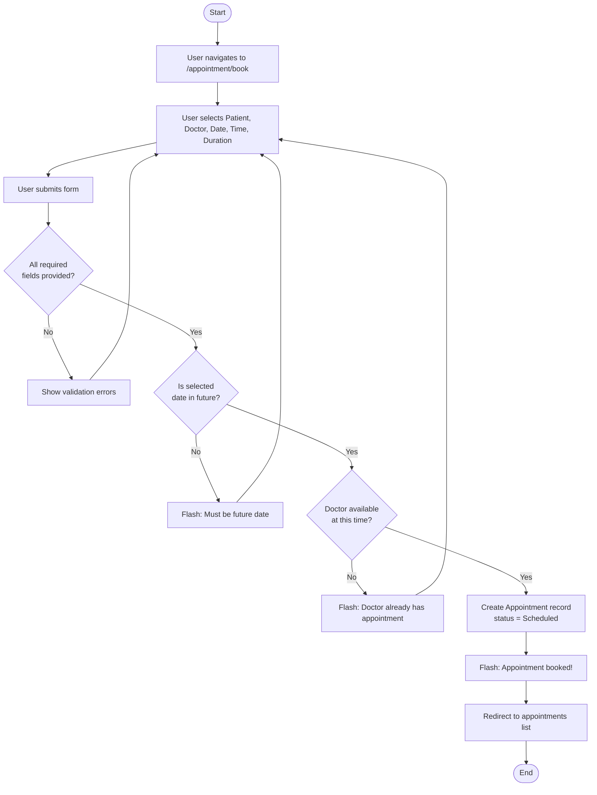
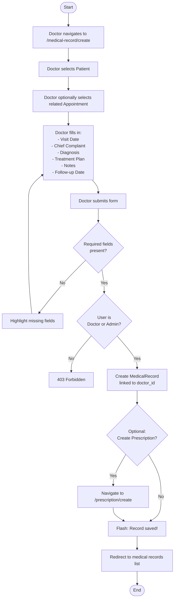

# Activity Diagrams
## Clinic Management System (ClinicMS)

---

## 1. Login Process Activity Diagram

---

## 2. Book Appointment Activity Diagram

---

## 3. Create Medical Record Activity Diagram

