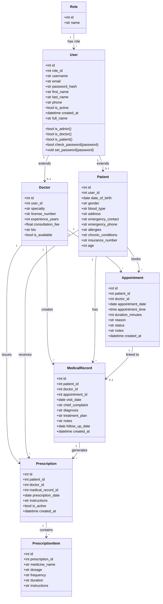

# Class Diagram
## Clinic Management System (ClinicMS)

---

## UML Class Diagram



---

## Class Descriptions

| Class | Type | Description |
|---|---|---|
| `Role` | Entity | Lookup table for user roles |
| `User` | Entity | Core identity and authentication |
| `Doctor` | Entity | Doctor professional profile (extends User) |
| `Patient` | Entity | Patient medical profile (extends User) |
| `Appointment` | Entity | Scheduled doctor-patient meeting |
| `MedicalRecord` | Entity | Clinical visit documentation |
| `Prescription` | Entity | Medication order by a doctor |
| `PrescriptionItem` | Entity | Single medicine in a prescription |

---

## Flask-Login Integration

The `User` class implements `Flask-Login`'s `UserMixin`:

```python
from flask_login import UserMixin

class User(db.Model, UserMixin):
    # UserMixin provides:
    # - is_authenticated (property)
    # - is_active (already defined)
    # - is_anonymous (property)
    # - get_id() (returns str(self.id))
    ...
```
