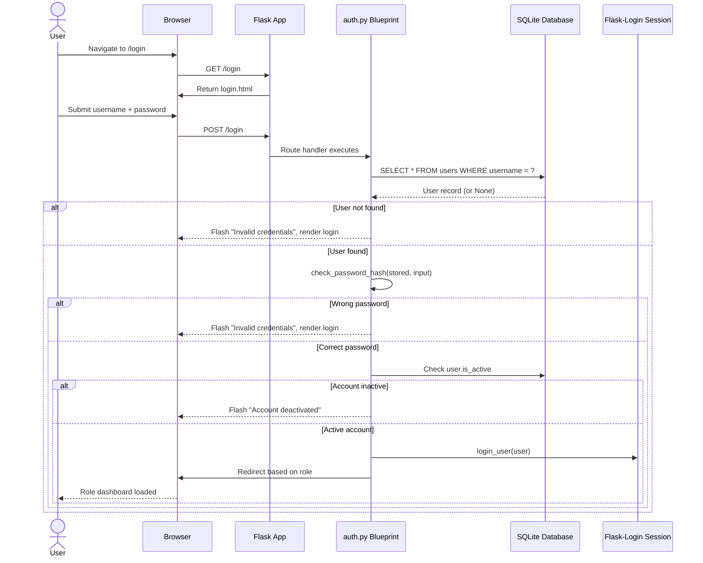
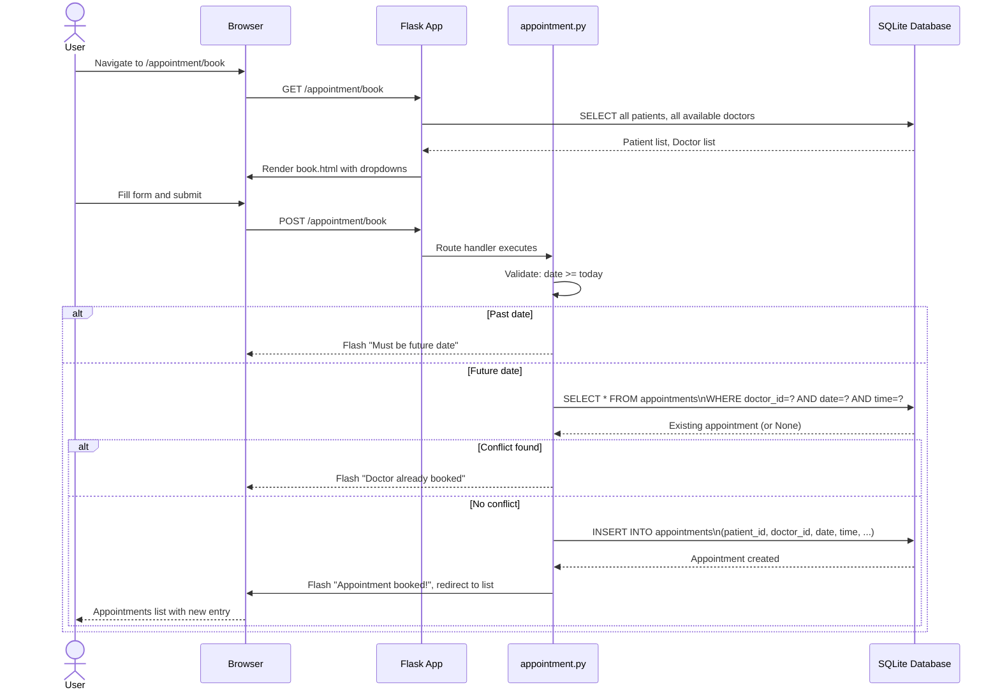
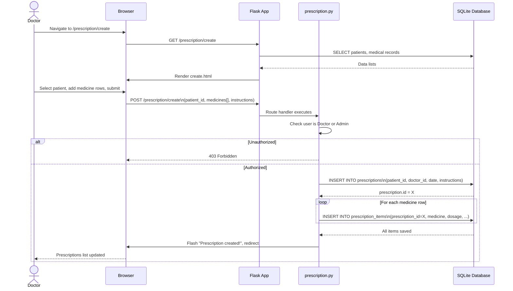

# Sequence Diagrams
## Clinic Management System (ClinicMS)

---

## 1. Login Sequence

```mermaid
sequenceDiagram
    actor User
    participant Browser
    participant FlaskApp as Flask App
    participant AuthBP as auth.py Blueprint
    participant DB as SQLite Database
    participant Session as Flask-Login Session

    User->>Browser: Navigate to /login
    Browser->>FlaskApp: GET /login
    FlaskApp->>Browser: Return login.html

    User->>Browser: Submit username + password
    Browser->>FlaskApp: POST /login
    FlaskApp->>AuthBP: Route handler executes

    AuthBP->>DB: SELECT * FROM users WHERE username = ?
    DB-->>AuthBP: User record (or None)

    alt User not found
        AuthBP-->>Browser: Flash "Invalid credentials", render login
    else User found
        AuthBP->>AuthBP: check_password_hash(stored, input)
        alt Wrong password
            AuthBP-->>Browser: Flash "Invalid credentials", render login
        else Correct password
            AuthBP->>DB: Check user.is_active
            alt Account inactive
                AuthBP-->>Browser: Flash "Account deactivated"
            else Active account
                AuthBP->>Session: login_user(user)
                AuthBP->>Browser: Redirect based on role
                Browser-->>User: Role dashboard loaded
            end
        end
    end
```

---

## 2. Book Appointment Sequence

```mermaid
sequenceDiagram
    actor User
    participant Browser
    participant FlaskApp as Flask App
    participant ApptBP as appointment.py
    participant DB as SQLite Database

    User->>Browser: Navigate to /appointment/book
    Browser->>FlaskApp: GET /appointment/book
    FlaskApp->>DB: SELECT all patients, all available doctors
    DB-->>FlaskApp: Patient list, Doctor list
    FlaskApp->>Browser: Render book.html with dropdowns

    User->>Browser: Fill form and submit
    Browser->>FlaskApp: POST /appointment/book
    FlaskApp->>ApptBP: Route handler executes

    ApptBP->>ApptBP: Validate: date >= today
    alt Past date
        ApptBP-->>Browser: Flash "Must be future date"
    else Future date
        ApptBP->>DB: SELECT * FROM appointments\nWHERE doctor_id=? AND date=? AND time=?
        DB-->>ApptBP: Existing appointment (or None)
        alt Conflict found
            ApptBP-->>Browser: Flash "Doctor already booked"
        else No conflict
            ApptBP->>DB: INSERT INTO appointments\n(patient_id, doctor_id, date, time, ...)
            DB-->>ApptBP: Appointment created
            ApptBP->>Browser: Flash "Appointment booked!", redirect to list
            Browser-->>User: Appointments list with new entry
        end
    end
```

---

## 3. Create Prescription Sequence

```mermaid
sequenceDiagram
    actor Doctor
    participant Browser
    participant FlaskApp as Flask App
    participant RxBP as prescription.py
    participant DB as SQLite Database

    Doctor->>Browser: Navigate to /prescription/create
    Browser->>FlaskApp: GET /prescription/create
    FlaskApp->>DB: SELECT patients, medical records
    DB-->>FlaskApp: Data lists
    FlaskApp->>Browser: Render create.html

    Doctor->>Browser: Select patient, add medicine rows, submit
    Browser->>FlaskApp: POST /prescription/create\n(patient_id, medicines[], instructions)
    FlaskApp->>RxBP: Route handler executes

    RxBP->>RxBP: Check user is Doctor or Admin
    alt Unauthorized
        RxBP-->>Browser: 403 Forbidden
    else Authorized
        RxBP->>DB: INSERT INTO prescriptions\n(patient_id, doctor_id, date, instructions)
        DB-->>RxBP: prescription.id = X

        loop For each medicine row
            RxBP->>DB: INSERT INTO prescription_items\n(prescription_id=X, medicine, dosage, ...)
        end

        DB-->>RxBP: All items saved
        RxBP->>Browser: Flash "Prescription created!", redirect
        Browser-->>Doctor: Prescriptions list updated
    end
```
