# Use Case Diagram
## Clinic Management System (ClinicMS)

---

## Full Use Case Diagram

```mermaid
flowchart LR
    Admin(["👤 Admin"])
    Doctor(["🩺 Doctor"])
    Patient(["🧑‍⚕️ Patient"])

    subgraph AUTH ["Authentication"]
        UC_LOGIN["Login"]
        UC_LOGOUT["Logout"]
    end

    subgraph ADMIN_UC ["Admin Use Cases"]
        UC_MGR_DOCS["Manage Doctors\n(CRUD)"]
        UC_MGR_PATS["Manage Patients\n(CRUD)"]
        UC_MGR_USERS["Manage Users\n(Activate/Deactivate)"]
        UC_VIEW_ALL["View All Records\n& Appointments"]
    end

    subgraph DOCTOR_UC ["Doctor Use Cases"]
        UC_DOC_DASH["View Dashboard"]
        UC_DOC_SCHED["View Schedule"]
        UC_DOC_COMPLETE["Complete Appointment"]
        UC_DOC_PROFILE["Edit Profile"]
        UC_DOC_PATIENTS["View My Patients"]
    end

    subgraph SHARED_UC ["Shared Use Cases"]
        UC_BOOK["Book Appointment"]
        UC_CANCEL["Cancel Appointment"]
        UC_CREATE_REC["Create Medical Record"]
        UC_CREATE_RX["Create Prescription"]
        UC_VIEW_REC["View Medical Records"]
        UC_VIEW_RX["View Prescriptions"]
    end

    subgraph PATIENT_UC ["Patient Use Cases"]
        UC_PAT_DASH["View Health Dashboard"]
        UC_PAT_HIST["View Appointment History"]
    end

    Admin --> UC_LOGIN
    Admin --> UC_LOGOUT
    Admin --> UC_MGR_DOCS
    Admin --> UC_MGR_PATS
    Admin --> UC_MGR_USERS
    Admin --> UC_VIEW_ALL
    Admin --> UC_BOOK
    Admin --> UC_CANCEL
    Admin --> UC_CREATE_REC
    Admin --> UC_CREATE_RX
    Admin --> UC_VIEW_REC
    Admin --> UC_VIEW_RX

    Doctor --> UC_LOGIN
    Doctor --> UC_LOGOUT
    Doctor --> UC_DOC_DASH
    Doctor --> UC_DOC_SCHED
    Doctor --> UC_DOC_COMPLETE
    Doctor --> UC_DOC_PROFILE
    Doctor --> UC_DOC_PATIENTS
    Doctor --> UC_BOOK
    Doctor --> UC_CANCEL
    Doctor --> UC_CREATE_REC
    Doctor --> UC_CREATE_RX
    Doctor --> UC_VIEW_REC
    Doctor --> UC_VIEW_RX

    Patient --> UC_LOGIN
    Patient --> UC_LOGOUT
    Patient --> UC_PAT_DASH
    Patient --> UC_PAT_HIST
    Patient --> UC_BOOK
    Patient --> UC_CANCEL
    Patient --> UC_VIEW_REC
    Patient --> UC_VIEW_RX
```

---

## Actor Descriptions

| Actor | Description | Access Level |
|---|---|---|
| **Admin** | Clinic administrator with full system access | Highest |
| **Doctor** | Registered medical professional | Medium |
| **Patient** | Registered clinic patient | Lowest |

---

## Use Case Summary

| Use Case | Admin | Doctor | Patient |
|---|---|---|---|
| Login | ✅ | ✅ | ✅ |
| Logout | ✅ | ✅ | ✅ |
| Manage Doctors | ✅ | ❌ | ❌ |
| Manage Patients | ✅ | ❌ | ❌ |
| Manage Users | ✅ | ❌ | ❌ |
| Book Appointment | ✅ | ✅ | ✅ |
| Cancel Appointment | ✅ | ✅ | ✅ |
| Complete Appointment | ✅ | ✅ | ❌ |
| Create Medical Record | ✅ | ✅ | ❌ |
| Create Prescription | ✅ | ✅ | ❌ |
| View Medical Records | ✅ (all) | ✅ (own) | ✅ (own) |
| View Prescriptions | ✅ (all) | ✅ (own) | ✅ (own) |
| Edit Doctor Profile | ❌ (via admin) | ✅ | ❌ |
