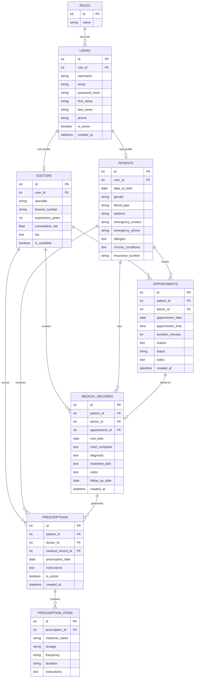

# Entity Relationship Diagram (ERD)
## Clinic Management System (ClinicMS)

---

## ERD — Mermaid Diagram

---

## Relationship Descriptions

| Relationship | Type | Description |
|---|---|---|
| ROLES → USERS | One-to-Many | One role is assigned to many users |
| USERS → DOCTORS | One-to-One | Each doctor user has exactly one doctor profile |
| USERS → PATIENTS | One-to-One | Each patient user has exactly one patient profile |
| DOCTORS → APPOINTMENTS | One-to-Many | A doctor can have many appointments |
| PATIENTS → APPOINTMENTS | One-to-Many | A patient can book many appointments |
| DOCTORS → MEDICAL_RECORDS | One-to-Many | A doctor creates many medical records |
| PATIENTS → MEDICAL_RECORDS | One-to-Many | A patient has many medical records |
| APPOINTMENTS → MEDICAL_RECORDS | One-to-Zero/One | An appointment may optionally have one medical record |
| DOCTORS → PRESCRIPTIONS | One-to-Many | A doctor issues many prescriptions |
| PATIENTS → PRESCRIPTIONS | One-to-Many | A patient receives many prescriptions |
| MEDICAL_RECORDS → PRESCRIPTIONS | One-to-Many | A medical record may generate many prescriptions |
| PRESCRIPTIONS → PRESCRIPTION_ITEMS | One-to-Many | A prescription contains one or more medicine items |

---

## Key Design Choices

- The **User** table acts as an identity base; Doctor and Patient extend it via One-to-One relationships
- **Roles** are stored in a lookup table (not an enum) for flexibility
- **Appointments** have a composite uniqueness constraint on `(doctor_id, appointment_date, appointment_time)` to prevent double-booking
- **MedicalRecord.appointment_id** is nullable — records can exist independent of a booked appointment
- **Prescription.medical_record_id** is nullable — prescriptions can be issued standalone
