# Use Case Descriptions
## Clinic Management System (ClinicMS)

---

## Use Case Diagram

```mermaid
flowchart TD
    Admin(["👤 Admin"])
    Doctor(["🩺 Doctor"])
    Patient(["🧑‍⚕️ Patient"])

    UC1["UC-001: Login"]
    UC2["UC-002: Manage Doctors"]
    UC3["UC-003: Manage Patients"]
    UC4["UC-004: Manage Users"]
    UC5["UC-005: Book Appointment"]
    UC6["UC-006: Cancel Appointment"]
    UC7["UC-007: Complete Appointment"]
    UC8["UC-008: Create Medical Record"]
    UC9["UC-009: Create Prescription"]
    UC10["UC-010: View Medical Records"]

    Admin --> UC1
    Admin --> UC2
    Admin --> UC3
    Admin --> UC4
    Admin --> UC5
    Admin --> UC6
    Admin --> UC7
    Admin --> UC8
    Admin --> UC9
    Admin --> UC10

    Doctor --> UC1
    Doctor --> UC5
    Doctor --> UC6
    Doctor --> UC7
    Doctor --> UC8
    Doctor --> UC9
    Doctor --> UC10

    Patient --> UC1
    Patient --> UC5
    Patient --> UC6
    Patient --> UC10
```

---

## UC-001: User Login

| Field | Details |
|---|---|
| **ID** | UC-001 |
| **Name** | User Login |
| **Actor** | Admin, Doctor, Patient |
| **Description** | Any registered user authenticates into the system using their username and password to gain role-appropriate access. |
| **Preconditions** | User must have an active account in the system. The user is not currently logged in. |
| **Postconditions** | User is authenticated and redirected to their role-specific dashboard. |

### Main Flow
1. User navigates to the login page (`/login`)
2. User enters their username and password
3. System validates credentials against the database
4. System verifies the account is active (`is_active = True`)
5. System creates a session for the user via Flask-Login
6. System redirects the user to their role dashboard:
   - Admin → `/admin/dashboard`
   - Doctor → `/doctor/dashboard`
   - Patient → `/patient/dashboard`

### Alternative Flow A: Invalid Credentials
- At step 3, if the username does not exist or the password is incorrect:
  - System displays flash message: "Invalid username or password"
  - User is returned to the login page

### Alternative Flow B: Inactive Account
- At step 4, if `is_active = False`:
  - System displays flash message: "Your account has been deactivated"
  - User is returned to the login page

---

## UC-002: Manage Doctors (Admin CRUD)

| Field | Details |
|---|---|
| **ID** | UC-002 |
| **Name** | Manage Doctors |
| **Actor** | Admin |
| **Description** | Administrator creates, reads, updates, and deletes doctor profiles along with their user accounts. |
| **Preconditions** | Actor is logged in as Admin. |
| **Postconditions** | Doctor profile is created/updated/deleted. Associated user account is created/modified/removed. |

### Main Flow (Create)
1. Admin navigates to `/admin/doctors`
2. Admin clicks "Add Doctor"
3. Admin fills in account information (name, username, email, password) and professional information (specialty, license, experience, fee, bio)
4. Admin submits the form
5. System validates all required fields are present
6. System checks that username and email are unique
7. System creates a `User` record with role=Doctor and hashed password
8. System creates a linked `Doctor` profile record
9. System displays success flash message and redirects to doctors list

### Alternative Flow A: Duplicate Username/Email
- At step 6, if username or email already exists:
  - System displays flash message: "Username or email already in use"
  - Form is redisplayed with entered values

### Main Flow (Delete)
1. Admin clicks the delete button next to a doctor
2. Browser prompts for confirmation via JavaScript dialog
3. Admin confirms
4. System deletes the Doctor profile and associated User account
5. System redirects to doctors list with success message

---

## UC-003: Manage Patients (Admin CRUD)

| Field | Details |
|---|---|
| **ID** | UC-003 |
| **Name** | Manage Patients |
| **Actor** | Admin |
| **Description** | Administrator creates, reads, updates, and deletes patient profiles and accounts. Includes searching patients by name or email. |
| **Preconditions** | Actor is logged in as Admin. |
| **Postconditions** | Patient profile is created/updated/deleted. |

### Main Flow (Create)
1. Admin navigates to `/admin/patients`
2. Admin clicks "Add Patient"
3. Admin fills in account information and medical information (DOB, gender, blood type, allergies, emergency contact, insurance)
4. Admin submits the form
5. System validates required fields
6. System creates a `User` record with role=Patient
7. System creates a linked `Patient` profile
8. System redirects to patients list with success message

### Main Flow (Search)
1. Admin enters a name or email in the search box
2. Admin submits the search form
3. System queries patients where name or email contains the search term (case-insensitive)
4. System displays filtered results

---

## UC-004: Manage User Accounts

| Field | Details |
|---|---|
| **ID** | UC-004 |
| **Name** | Toggle User Account Status |
| **Actor** | Admin |
| **Description** | Administrator activates or deactivates any user account to control system access. |
| **Preconditions** | Actor is logged in as Admin. Target user exists and is not the Admin themselves. |
| **Postconditions** | User's `is_active` flag is toggled. User can/cannot log in as appropriate. |

### Main Flow
1. Admin navigates to `/admin/users`
2. Admin views list of all users with their current status
3. Admin clicks "Activate" or "Deactivate" for a target user
4. System toggles the `is_active` field
5. System displays confirmation message

### Alternative Flow: Self-Deactivation Attempt
- At step 3, if the target user is the current admin:
  - The deactivate button is not displayed (hidden in template)
  - System shows "Current User" label instead

---

## UC-005: Book Appointment

| Field | Details |
|---|---|
| **ID** | UC-005 |
| **Name** | Book Appointment |
| **Actor** | Admin, Doctor, Patient |
| **Description** | An authorized user books an appointment between a patient and a doctor for a future date and time. |
| **Preconditions** | User is logged in. At least one active doctor and one active patient exist. |
| **Postconditions** | A new appointment record is created with status "Scheduled". |

### Main Flow
1. User navigates to "Book Appointment"
2. User selects a patient from the dropdown (Admin/Doctor see all; Patient sees themselves)
3. User selects an available doctor
4. User selects a future date and a time (08:00–18:00)
5. User selects duration (15, 30, 45, or 60 minutes)
6. User enters an optional reason for the visit
7. User submits the form
8. System checks that the date is not in the past
9. System checks for conflicting appointments for the same doctor at the same date/time
10. System creates the appointment record with status="Scheduled"
11. System redirects to appointments list with success message

### Alternative Flow A: Past Date
- At step 8, if the selected date is in the past:
  - System displays: "Appointments must be booked for future dates"

### Alternative Flow B: Time Conflict
- At step 9, if the doctor already has an appointment at that time:
  - System displays: "Doctor already has an appointment at this time"

---

## UC-006: Cancel Appointment

| Field | Details |
|---|---|
| **ID** | UC-006 |
| **Name** | Cancel Appointment |
| **Actor** | Admin, Patient |
| **Description** | An appointment with status "Scheduled" is cancelled by a patient or admin. |
| **Preconditions** | Appointment exists with status "Scheduled". Actor is the patient who owns it or an Admin. |
| **Postconditions** | Appointment status is changed to "Cancelled". |

### Main Flow
1. User navigates to their appointments list or appointment detail
2. User clicks "Cancel" on a Scheduled appointment
3. JavaScript confirmation dialog appears
4. User confirms cancellation
5. System updates appointment status to "Cancelled"
6. System redirects with success message

### Alternative Flow: Already Completed/Cancelled
- If the appointment is not in "Scheduled" status:
  - The Cancel button is not rendered in the template

---

## UC-007: Complete Appointment

| Field | Details |
|---|---|
| **ID** | UC-007 |
| **Name** | Mark Appointment as Complete |
| **Actor** | Admin, Doctor |
| **Description** | A doctor or admin marks a scheduled appointment as completed after the patient visit. |
| **Preconditions** | Appointment exists with status "Scheduled". Actor is the doctor assigned or an Admin. |
| **Postconditions** | Appointment status is changed to "Completed". |

### Main Flow
1. Doctor views today's schedule on dashboard or appointments list
2. Doctor clicks the checkmark/complete button for a Scheduled appointment
3. System updates appointment status to "Completed"
4. System redirects with success message
5. Doctor may now create a medical record for the completed appointment

---

## UC-008: Create Medical Record

| Field | Details |
|---|---|
| **ID** | UC-008 |
| **Name** | Create Medical Record |
| **Actor** | Doctor, Admin |
| **Description** | A doctor creates a medical record documenting the clinical details of a patient visit including diagnosis, treatment plan, and optional follow-up date. |
| **Preconditions** | Actor is logged in as Doctor or Admin. At least one patient exists. |
| **Postconditions** | A medical record is saved linked to the patient and optionally to an appointment. |

### Main Flow
1. Doctor navigates to "New Medical Record"
2. Doctor selects the patient
3. Optionally links to a completed appointment
4. Doctor enters: visit date, chief complaint, diagnosis, treatment plan, notes, follow-up date
5. Doctor submits the form
6. System validates required fields (patient, chief complaint, diagnosis)
7. System creates the MedicalRecord record linked to the doctor
8. System redirects to medical records list with success message

---

## UC-009: Create Prescription

| Field | Details |
|---|---|
| **ID** | UC-009 |
| **Name** | Create Prescription |
| **Actor** | Doctor, Admin |
| **Description** | A doctor creates a prescription with one or more medicine items for a patient. |
| **Preconditions** | Actor is logged in as Doctor or Admin. At least one patient exists. |
| **Postconditions** | A prescription record and associated medicine items are saved. |

### Main Flow
1. Doctor navigates to "New Prescription"
2. Doctor selects the patient and optionally a medical record
3. Doctor enters the prescription date and general instructions
4. Doctor adds one or more medicine rows (name, dosage, frequency, duration, instructions)
5. Doctor submits the form
6. System validates at least one medicine item is provided
7. System creates `Prescription` and multiple `PrescriptionItem` records
8. System redirects to prescriptions list

### Alternative Flow: No Medicines
- At step 6, if no medicine rows are submitted:
  - System displays: "At least one medicine item is required"

---

## UC-010: View Medical Records

| Field | Details |
|---|---|
| **ID** | UC-010 |
| **Name** | View Medical Records |
| **Actor** | Admin, Doctor, Patient |
| **Description** | Users view medical records filtered by their role. Admins see all records; doctors see records they created; patients see only their own records. |
| **Preconditions** | User is logged in. |
| **Postconditions** | Medical records appropriate to the user's role are displayed. |

### Main Flow
1. User navigates to the medical records section
2. System queries records filtered by role:
   - Admin: all records
   - Doctor: records where `doctor_id == current_user.doctor.id`
   - Patient: records where `patient_id == current_user.patient.id`
3. System displays the filtered list in a table
4. User clicks "View Details" on any record
5. System displays the full record including chief complaint, diagnosis, treatment plan, and linked prescriptions
